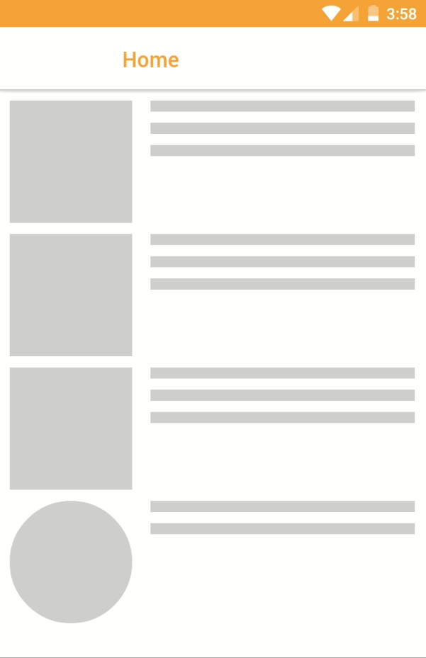
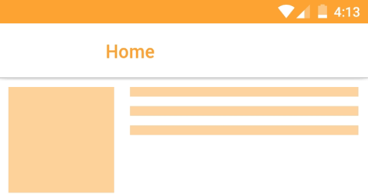

# React Native Skeleton Loader
Skeleton loaders give the user a perception that loading has taken a shorter period.



##  Installation
```
npm install react-native-skeleton-loader
```

## Basic Usage
After installation, import the package into react native components by

```
import SkeletonLoader from react-native-skeleton-loader;

<SkeletonLoader type="square" loading={loading}>
  <Image
    style={{width: 110, height: 110}}
    source={{uri: 'https://facebook.github.io/react-native/docs/assets/favicon.png'}}
  />
</SkeletonLoader>
```
The view that should be shown once loaded is wrapped in the skeleton loader!

## Props
Props | Accepted Values | Required |Default
------------ | ------------- | -------------- | ----------------
type | square, rectangle, circle | true | -
loading | boolean | true | -
size | number | false | 100
height | number | false | 100
color | string | false | #dfdfdf
highlightColor | string | false| #c8c8c8
rows | number | false | 1

## Color and Highlight Color


```
<View style={{ flex: 1, flexDirection: 'column'}}>
  <SkeletonLoader type="square" size={110} loading={loading} color='ffa433' highlightColor='#ffbf70'>
    <Image
      style={{width: 90, height: 90, alignSelf:'center'}}
      source={require('./images/truck.png')}
      resizeMode="contain"
    />
  </SkeletonLoader>
</View>
<View style={{ flex: 2, flexDirection: 'column'}}>
  <SkeletonLoader type="rectangle" rows={3} height={10} loading={loading}  color='ffa433' highlightColor='#ffbf70'>
    <Text style={styles.boldText}>Luxembourg to Brussels</Text>
    <Text style={styles.normalText}>Location: Luxembourg</Text>
    <Text style={styles.normalText}>Distance: 1,200 Kms</Text>
    <Button 
      block 
      light
      style={styles.button}>
      <Text style={styles.buttonText}>Make a bid</Text>
    </Button>
  </SkeletonLoader> 
</View>
```
## Circle
```
<SkeletonLoader type="circle" size={110} loading={loading}>
  <Thumbnail large source={require('./images/avatar-teen.jpg')} />
</SkeletonLoader>
```
## Square
```
<SkeletonLoader type="square" size={110} loading={loading}>
  <Image
    style={{width: 90, height: 90, alignSelf:'center'}}
    source={require('./images/truck.png')}
    resizeMode="contain"
  />
</SkeletonLoader>
```
## Rectangle
```
<SkeletonLoader type="rectangle" rows={3} height={10} loading={loading}>
  <Text style={styles.boldText}>Luxembourg to Brussels</Text>
  <Text style={styles.normalText}>Location: Luxembourg</Text>
  <Text style={styles.normalText}>Distance: 1,200 Kms</Text>
  <Button 
    block 
    light
    style={styles.button}>
    <Text style={styles.buttonText}>Make a bid</Text>
  </Button>
</SkeletonLoader>  
```
